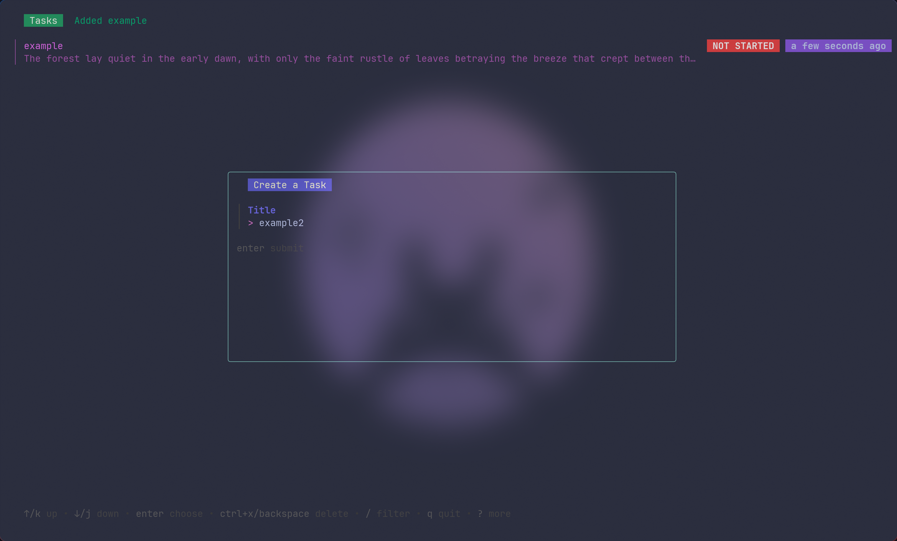

# Beaver Task

Beaver Task is a terminal-based task manager built with Charmbracelet's Bubble Tea toolkit. It combines a scrollable task list with a modal form so you can review existing work, add new items, and manage task state without leaving the terminal. Task data is stored in SQLite and the schema is kept up to date automatically when the app launches.

## Features
- Bubble Tea UI with separate background list and foreground modal for task capture, coordinated by a manager model (`tui/manager.go`).
- SQLite-backed persistence with schema bootstrapping from `schema.sql` and strongly typed queries generated by `sqlc` (`database/query.sql.go`).
- Configurable data directory that falls back to XDG-compliant defaults when no config file is supplied (`config/init.go`).
- Keyboard-first workflow including shortcuts for toggling list chrome, entering the add-task modal, and updating task status (`tui/keymaps.go`).

## Requirements
- Go 1.24 or newer (matching the version declared in `go.mod`).

## Installation
Clone the repository, build the binary, and run it:

```bash
git clone https://github.com/Sheriff-Hoti/beaver-task.git
cd beaver-task

go build ./...
./beaver-task [-config path/to/config.json]
```

Passing `-config` is optional; if omitted, the app creates and uses an XDG-compliant database path automatically. A sample config that points at the bundled test database lives at `test/assets/config.json`.

## Development
For local development against the sample configuration, you can use the built-in Make target:

```bash
make dev
```

## In Progress
- Add dedicated buttons in the foreground modal (close modal, submit, quit) to improve accessibility of actions (`todo`).
- Provide a modal option to cleanly exit the application while the overlay is active (`todo`).
- Tighten validation rules in the Huh form, especially for required fields (`todo`).

## Example

